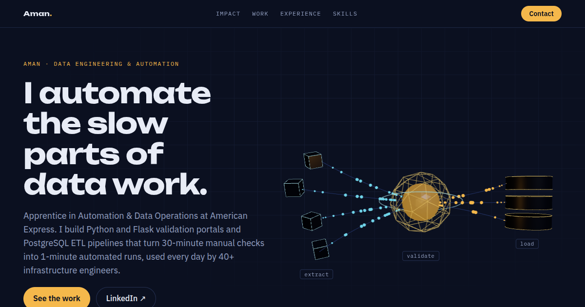

# Aman · Data & Automation Portfolio

**Live site → https://amannnn7.github.io**

A personal portfolio for data engineering and automation work. The hero is an interactive 3D data pipeline, built with Three.js: raw records (cyan) are extracted from source systems, pass through a validation core, and load into a warehouse as clean rows (amber). It mirrors the validation and ETL tooling I build at American Express.



## Tech stack

| Layer | Tools |
|---|---|
| UI | React 19, Tailwind CSS v4 |
| 3D | Three.js r186 via React Three Fiber 9 + drei |
| Motion | Motion (hero entrance), CSS scroll-driven animations (`animation-timeline: view()`) |
| Build | Vite 8 (Rolldown bundler) |
| Deploy | GitHub Actions → GitHub Pages on every push to `main` |

## Engineering details

- **Content lives in data, not markup.** All text and numbers are in [`src/data/profile.js`](src/data/profile.js); components only render it.
- **The 3D scene is code-split** with `React.lazy`, so the text paints before the ~250 KB (gzipped) Three.js bundle loads.
- **Particles use one `InstancedMesh` per stream.** About 100 particles move along Bézier curves in 2 draw calls.
- **Rendering pauses off-screen.** An `IntersectionObserver` switches the canvas `frameloop` to `never` when the hero scrolls away.
- **Graceful fallbacks.** The page checks for WebGL, falls back to an SVG if it's missing, and uses an error boundary around the canvas. It respects `prefers-reduced-motion`.
- **Impact bars are drawn to scale** from the before/after numbers, not by hand.
- **Fonts are self-hosted**, with Latin subsets only, via Fontsource.
- **SEO and link previews:** Open Graph tags, an OG image and schema.org `Person` JSON-LD.

## Project structure

```
src/
  data/profile.js               all portfolio content
  App.jsx                       page sections
  components/Hero3D.jsx         WebGL check, lazy-load, pause off-screen, fallback
  components/PipelineScene.jsx  the 3D pipeline scene
  index.css                     Tailwind v4 theme tokens + scroll-driven animations
public/                         favicon, og.png
.github/workflows/deploy.yml    CI build + deploy to GitHub Pages
```

## Run locally

```bash
npm install
npm run dev          # http://localhost:5173
npm run build        # production build in dist/
npm run build:single # one self-contained HTML file in dist-single/
```

## Contact

[LinkedIn](https://www.linkedin.com/in/aman-024058231) · kumaraman9844@gmail.com
